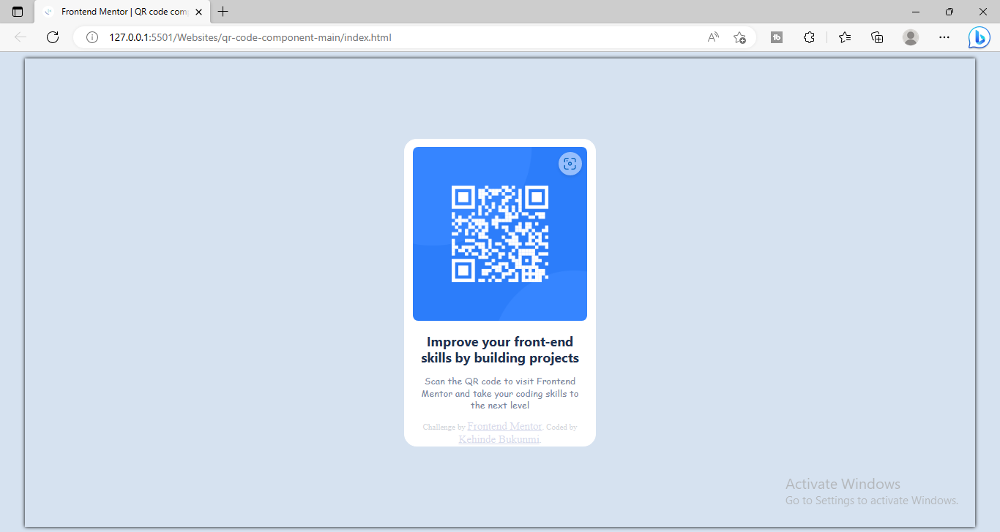
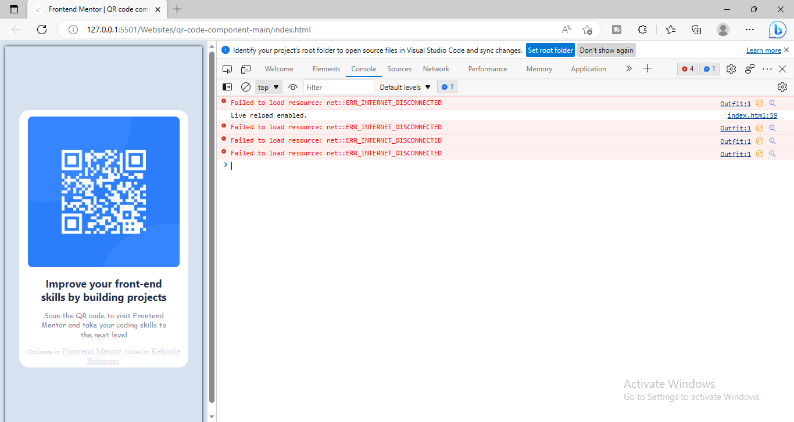
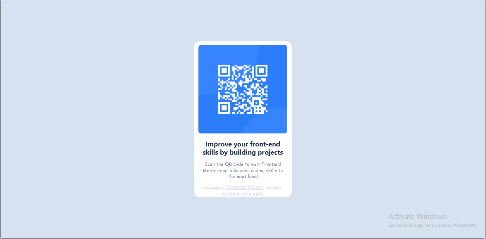

# Frontend Mentor - QR code component solution

This is a solution to the [QR code component challenge on Frontend Mentor](https://www.frontendmentor.io/challenges/qr-code-component-iux_sIO_H). Frontend Mentor challenges help you improve your coding skills by building realistic projects. 

## Table of contents

- [Overview](#overview)
  - [Screenshot](#screenshot)
  - [Links](#links)
- [My process](#my-process)
  - [Built with](#built-with)
  - [What I learned](#what-i-learned)
  - [Continued development](#continued-development)
  - [Useful resources](#useful-resources)
- [Author](#author)
- [Acknowledgments](#acknowledgments)


## Overview

### Screenshot

#### preview



#### views



### Links

- Solution URL: [Add solution URL here](https://your-solution-url.com)
- Live Site URL: [Add live site URL here](https://your-live-site-url.com)

## My process

### Built with

- Semantic HTML5 markup
- CSS custom properties
- CSS Grid

### What I learned

I learnt more about CSS: animations, shadow-box ... . I realized that patient is the only key for a web developers success, I almost gave up because as we know CSS is so complicated and it won't give you any error no matter how much you messed it up, It will only display opposite what you expected.

I also learnt some codes like a professional front-end developer ...

```html
<div class="attribution">
      Challenge by <a href="https://www.frontendmentor.io?ref=challenge" target="_blank">Frontend Mentor</a>.
      Coded by <a href="#">Kehinde Bukunmi</a>.
    </div>
```
```css
:root{
    --White: hsl(0, 0%, 100%);
    --Light: hsl(212, 45%, 89%);
    --Grayish: hsl(220, 15%, 55%);
    --Dark-gb: hsl(218, 44%, 22%);

}

body{
    margin-top: 9px !important;
    background: var(--Light);
    display: flex;
    justify-content: center;
    align-items: center;
    ................
}

#container{
    margin-top: 110px !important;
    background-color: var(--White);
    width: 20%;
    text-align: center;
    border-radius: 17px;
    align-items: center;
    justify-content: center;
    display: flex;
    flex-flow: wrap;
    line-height: 1.1rem;
    border: 1px solid var(--White);
    color: var(--Dark-gb);
}

@media(max-width:375px){
  ........................
}
```
```js
  no javascript included
```

### Continued development

I will like to add a back-end server to the QR code.

## Author

- Website - [Kehinde Bukunmi](https://www.your-site.com)
- Frontend Mentor - [@kenny-hue](https://www.frontendmentor.io/profile/kenny-hue)
